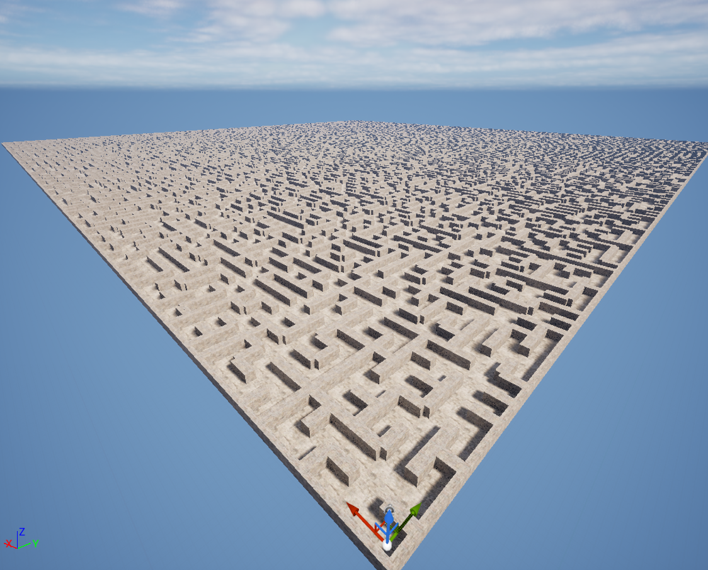
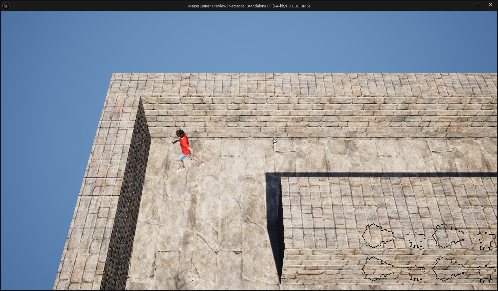

# MazeRunner

Developed with Unreal Engine 5

# How to setup on MacOS

- Clone branch, navigate to path ``/Users/Shared/Epic Games/UE_5.5/Engine/Build/BatchFiles/Mac``. 
- Generate XCode workspace using ``sh GenerateProjectFiles.sh -project="/Users/devansh/schoolProjects/computer_graphics/mazerunner/MazeRunner.uproject" -game
``.
- Build from XCode.

# Features
* Traps
    * Spikes
    * Mines
* Player movement
* Randomly generated maze
* Find all 4 keys to open treasure chest and win
* 3 sets of difficulty, Easy, Medium, and Hard

